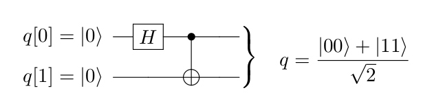

# Forest SDK

## How to install

### Instructions from Forest SDK documentation

Instructions: http://docs.rigetti.com/en/stable/start.html

### Creating virtual environment in Python
Often different projects require libraries with different versions. The virtual environment is a method to keep controll of the software needed in different projects and avoid conflicts of versions.

```shell
# Move to the directory you want to use to create the virtual environment
# (often created inside the home directory)
cd My/virtual/env/here
# Create virtual environment named "forest"
virtualenv forest
# Activate virtual environment
source forest/bin/activate
```
If you use an older version of python as default, you might need to specify a newer one when creating the virtual environment.
```shell
# Create virtual environment named "fotest" with python version my-python-version
virtualenv forest --python=my-python-version
```

### Installing Pyquil - Python software for the Forest SDK
Once inside a virtual environment, you can install the software via:

```shell
pip install pyquil
```

### Installing *qvm* and *quilc* for local simulation

Instructions: http://docs.rigetti.com/en/stable/start.html#installing-the-qvm-and-compiler-on-linux-deb

You have to request the installation files via https://www.rigetti.com/forest -> Download the new Forest SDK.
Once you receive via e-mail and download to your computer, extract the `.tar.bz2` and run the `.deb` file:
```shell
sudo ./forest-sdk-2.0rc2-linux-deb.run
```

If you need tu uninstall the qvm and quilc, type the following command in terminal:
```shell
sudo apt remove forest-sdk
```

## How to run a program (local simulation) on Python interpreter

It is necessary to activate the QVM and the compiler Quilc before running the program. This is done by oppening two extra terminal windows/tabs. In one of them, run:

```shell
qvm -S
```

and in the other one, run:

```shell
quilc -S
```

Then you need to activate the virtual environment in which the Ocean SDK is installed.

```shell
# Move to the directory of the virtual environment
# (often created inside the home directory)
cd My/virtual/env/here
# Activate virtual environment
source forest/bin/activate
```

Next, you need to enter the Python Interpreter from inside the directory of your python program.

```shell
# Move to the directory of the python program
cd My/python/program/directory
# Enter the python interpreter
python
```

The following command in python executes the python program and keeps the results and the variables in memory for further use. This behaviour is similar to Matlab, in which you run a .m script and the variables are kept in the workspace, where you can read or use them latter. 

```python
# Run Python program in the interpreter
exec(open('my-python-program.py').read())
```

## Getting Started

The program `getting-started-forest-sdk.py` is a simple example of how to write a program using Pyquil/Forest SDK. This program was written following an example in the Forest SDK documentation: 

### Purpose of the program
Create the Bell State:


### Operation principle 

The Bell state mentioned above can be created by the following quantum circuit:



### How to run the program

First, activate the QVM and the Quilc compiler by oppening two extra terminals and entering in each one of then:
```shell
qvm -S
```
```shell
quilc -S
```

Let's suppose the virtual environment is set up in the home directory and this whole GitHub repository is in Desktop.
```shell
# Move to the directory of the virtual environment
# (often created inside the home directory)
cd ~
# Activate virtual environment
source forest/bin/activate
# Move to the directory of the program
cd Desktop/qc-tutorials/forest-sdk/getting-started
# Open Python interpreter
python
```

Inside the Python Interpreter:

```python
exec(open('getting-started-forest-sdk.py').read())
```

### Expected output

```
Quantum Program in PyQuil (without measurements):
H 0
CNOT 0 1


Inspecting wavefunction after the quantum circuit:
(0.7071067812+0j)|00> + (0.7071067812+0j)|11>


Quantum Program in PyQuil (complete):
H 0
CNOT 0 1
DECLARE ro BIT[2]
MEASURE 0 ro[0]
MEASURE 1 ro[1]


Available backends for simulating the circuit:
   9q-square-qvm
   9q-square-noisy-qvm
   2q-qvm
   3q-qvm
   nq-qvm for n = 2, 3, 4, ...


Using backend 2q-qvm and creating quantum circuit.


Running the program on choosen backend.


Results for the qubits in each shot:
[q0 q1]
[[0 0]
 [0 0]
 [1 1]
 [1 1]
 [1 1]
 [0 0]
 [1 1]
 [0 0]
 [0 0]
 [0 0]
 [0 0]
 [0 0]
 [1 1]
 [1 1]
 [1 1]
 [1 1]
 [1 1]
 [0 0]
 [1 1]
 [0 0]
 [1 1]
 [0 0]
 [0 0]
 [0 0]
 [1 1]
 [0 0]
 [0 0]
 [1 1]
 [1 1]
 [1 1]
 [1 1]
 [1 1]]


The results of the simulation are:
(integer notation)
    State    Counts
    0       15
    1       0
    2       0
    3       17


The results of the simulation are:
(binary notation)
    State    Counts
    00       15
    01       0
    10       0
    11       17

```


