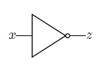
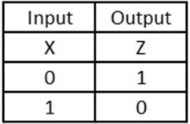
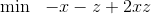
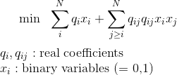
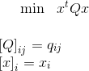

# Ocean SDK

## How to install

### Instructions from Ocean SDK documentation

Instructions: https://docs.ocean.dwavesys.com/en/latest/overview/install.html

### Creating virtual environment in Python
Often different projects require libraries with different versions. The virtual environment is a method to keep controll of the software needed in different projects and avoid conflicts of versions.

```shell
# Move to the directory you want to use to create the virtual environment
# (often created inside the home directory)
cd My/virtual/env/here
# Create virtual environment named "ocean"
virtualenv ocean
# Activate virtual environment
source ocean/bin/activate
```
If you use an older version of python as default, you might need to specify a newer one when creating the virtual environment.
```shell
# Create virtual environment named "ocean" with python version my-python-version
virtualenv ocean --python=my-python-version
```

### Installing Ocean SDK
Once inside a virtual environment, you can install the software via:

```shell
pip install dwave-ocean-sdk
```

## How to run a program on Python interpreter

First you need to activate the virtual environment in which the Ocean SDK is installed.

```shell
# Move to the directory of the virtual environment
# (often created inside the home directory)
cd My/virtual/env/here
# Activate virtual environment
source ocean/bin/activate
```
Next, you need to enter the Python Interpreter from inside the directory of your python program.

```shell
# Move to the directory of the python program
cd My/python/program/directory
# Enter the python interpreter
python
```

The following command in python executes the python program and keeps the results and the variables in memory for further use. This behaviour is similar to Matlab, in which you run a .m script and the variables are kept in the workspace, where you can read or use them latter. 

```python
# Run Python program in the interpreter
exec(open('my-python-program.py').read())
```

## Getting Started

The program `getting-started-ocean-sdk.py` is a simple example of how to write a program using Ocean SDK. This program was written following an example in the Ocean SDK documentation: https://docs.ocean.dwavesys.com/en/latest/examples/not.html#not 

### Purpose of the program
Simulate the behaviour of a NOT gate.
Classical simulation of a quantum algorithm for adiabatic quantum computation.

### Operation principle 

The NOT gate has a binary input `x` and a binary output `z` which is the negation of the input.



Source: https://docs.ocean.dwavesys.com/en/latest/examples/not.html#not

The expected behaviour of the gate is given by the following table.



We can translate this to a QUBO problem:



The program uses Ocean SDK's classical simulator to solve this QUBO problem.

### How to run the program
Let's suppose the virtual environment is set up in the home directory and this whole GitHub repository is in Desktop.
```shell
# Move to the directory of the virtual environment
# (often created inside the home directory)
cd ~
# Activate virtual environment
source ocean/bin/activate
# Move to the directory of the program
cd Desktop/qc-tutorials/ocean-sdk/getting-started
# Open Python interpreter
python
```
Inside the Python Interpreter:

```python
exec(open('getting-started-ocean-sdk.py').read())
```

### Expected output

```python
Energy and samples for the Hamiltonian:
sample  |  energy
{'x': 1, 'z': 0}  |  -1.0
{'x': 0, 'z': 1}  |  -1.0
{'x': 0, 'z': 0}  |  0.0
{'x': 1, 'z': 1}  |  0.0


Minimum energy solutions:
{'x': 1, 'z': 0}  |  -1.0
{'x': 0, 'z': 1}  |  -1.0
```

### Appendix: QUBO problems

QUBO stands for _Quadratic Unconstrained Binary Optimization_ and a QUBO problem is:



The QUBO coefficients `q_i` and `q_ij` can be stored in a matrix `Q` and the QUBO expression becomes:




